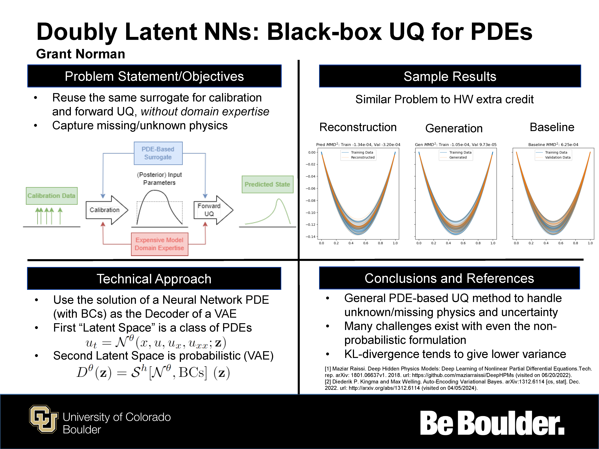

# Doubly Latent Neural Networks
As a class project for **ASEN 6412: Uncertainty Quantification**, I explore the novel idea of what I term
"Doubly Latent Neural Networks" (DLNNs).
The [final report](./ASEN6412_Project.pdf) provides a detailed explanation of the theory and results.
Nonetheless, the main idea is repeated here.

Partial Differential Equations (PDEs) are commonly used to model physical systems.
Yet, sometimes parameters in these PDEs are uncertain.
Similarly, the form of the PDE itself may be unknown.
Traditionally, practitioners derive some form of the PDE for their system of interest,
identify the uncertain parameters, use data to estimate the uncertainty of these parameters,
and the solve these Stochastic PDEs (SPDEs).
This requires substantial domain specific knowledge, solving expensive inverse problems,
and forward uncertainty quantification.

Doubly Latent Neural Networks are a novel approach where only a single inverse problem is solved,
without domain specific knowledge.
A governing PDE and its interaction with uncertain parameters are learned directly from data.
This is done by using a structure resembling a Variational Autoencoder (VAE).
The first latent space is the standard VAE latent space, which represents the uncertainty in the system.
The second latent space is from imposing a PDE structure, as solutions of PDEs lie on a lower-dimensional manifold.
Further details are provided in the [final report](./ASEN6412_Project.pdf), or summarized briefly below.

